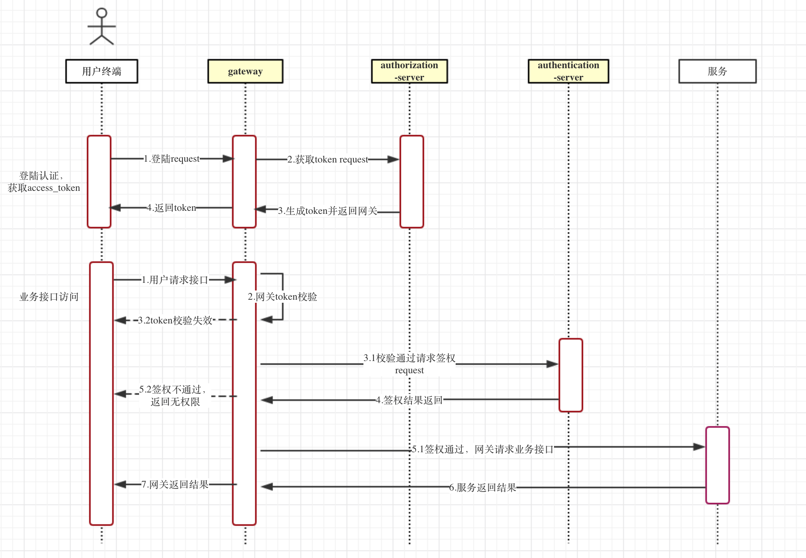

签权应用
----------

## 关键词

`签权、认证`

## 简介

签权微服务，可供网关gateway实现微服务对外权限的签定。



## 启动

### 先决条件

- [postgresql](http://www.postgresql.org/)
- [rabbitmq](http://rabbitmq.io/download)
- [nacos](../../docs/register.md)

### 启动命令

进入应用目录

启动命令：`mvn spring-boot:run`

docker镜像打包：`mvn docker:build`


### MvcRequestMatcher
spring secuity是控制URL的访问权限的，那么spring secuity是怎样拦截匹配URL，我们先看一个接口RequestMatcher
匹配HttpServletRequest的简单策略接口RequestMatcher，其下定义了matches方法，如果返回是true表示提供的请求与提供的匹配规则匹配，如果返回的是false则不匹配

### HttpServletRequestWrapper
HttpServletRequest的装饰类，可以修改请求的参数。

------

## RabbitMQ的使用
#### 生产者
1、创建队列、交换机、绑定队列与交换机、统一发送数据的格式
```
// 创建队列
    @Bean
    public Queue queue(){
        log.info("init queue : {}", QUEUE_NAME);
        return new Queue(QUEUE_NAME);
    }
    // 创建交换机
    @Bean
    public TopicExchange exchange(){
        log.info("init exchange : {}", EXCHANGE_NAME);
        return new TopicExchange(EXCHANGE_NAME);
    }
    // 将队列与交换机绑定
    @Bean
    public Binding bindQueue2ExchangeWithRoutingKey(Queue queue, TopicExchange exchange){
        log.info("binding queue: {}, exchange:{} , withRoutingkey: {}", QUEUE_NAME, EXCHANGE_NAME, ROUTING_KEY_NAME);
        return BindingBuilder.bind(queue).to(exchange).with(ROUTING_KEY_NAME);
    }

    // 以Json个是发送消息
    @Bean
    public MessageConverter messageConverter(){
        ObjectMapper objectMapper = new ObjectMapper();
        objectMapper.setVisibility(PropertyAccessor.ALL, JsonAutoDetect.Visibility.ANY);
        return new ContentTypeDelegatingMessageConverter(new Jackson2JsonMessageConverter(objectMapper));
    }

```
2、发送数据
```
    @Autowired
    private RabbitTemplate rabbitTemplate;

    @Autowired
    private MessageConverter messageConverter;
    // 初始化方法
    @PostConstruct
    public void init(){
        rabbitTemplate.setMessageConverter(messageConverter);
    }
    // 发送消息
    public void send(String routingKey, Object object){
        log.info("routingKey: {},  send message: {} ", routingKey, object);
        rabbitTemplate.convertAndSend(BusConfig.EXCHANGE_NAME, routingKey, object);
    }
```

#### 消费者

1、创建队列、交换机、绑定队列和交换机
```
// 创建队列
    @Bean
    public Queue queue(){
        log.info("init queue : {}", QUEUE_NAME);
        return new Queue(QUEUE_NAME);
    }

    // 创建交换机
    @Bean
    public TopicExchange exchange(){
        log.info("init exchange : {}", EXCHANGE_NAME);
        return new TopicExchange(EXCHANGE_NAME);
    }

    // 将队列与交换机绑定
    @Bean
    public Binding bindQueue2ExchangeWithRoutingKey(Queue queue, TopicExchange exchange){
        log.info("binding queue: {}, exchange:{} , withRoutingkey: {}", queue.getName(), EXCHANGE_NAME, ROUTING_KEY_NAME);
        return BindingBuilder.bind(queue).to(exchange).with(ROUTING_KEY_NAME);
    }

    /**
     *  接受消息类型一定要和消息发送类型一致，不然会报异常
     *  MessageConverter 为统一消息转化类型
     *
     * @return
     */
    @Bean
    public MessageConverter messageConverter(){
        ObjectMapper objectMapper = new ObjectMapper();
        objectMapper.setVisibility(PropertyAccessor.ALL, JsonAutoDetect.Visibility.ANY);
        return new ContentTypeDelegatingMessageConverter(new Jackson2JsonMessageConverter(objectMapper));
    }
```

2、配置消息监听容器和消息适配器
```
    /**
     * 消息监听容器
     * 
     * 绑定指定队列和消息适配器
     * 
     * @param connectionFactory
     * @param messageListenerAdapter
     * @param queue
     * @return
     */
    @Bean
    public SimpleMessageListenerContainer messageListenerContainer(ConnectionFactory connectionFactory, MessageListenerAdapter messageListenerAdapter, Queue queue){
        SimpleMessageListenerContainer simpleMessageListenerContainer = new SimpleMessageListenerContainer(connectionFactory);
        simpleMessageListenerContainer.setQueueNames(queue.getName());
        simpleMessageListenerContainer.setMessageListener(messageListenerAdapter);
        return simpleMessageListenerContainer;
    }

    /**
     * 消息适配器
     * 
     * 设置消息接受代理，默认代理方法为 handleMessage
     * 设置消息接受数据类型。
     * 
     * @param receiver 接受代理
     * @param messageConverter
     * @return
     */
    @Bean
    public MessageListenerAdapter messageListenerAdapter(EventReceiver receiver, MessageConverter messageConverter){
        return new MessageListenerAdapter(receiver, messageConverter);
    }
```

3、处理消息

```
/**
     *  handleMessage 为消息接受默认代理方法
     * @param resource
     */
    public void handleMessage(Resource resource){
        log.info("receive resource: {}" ,resource);
        resourceService.saveResource(resource);
    }
```

需要注意的是：

1、发送的数据如果是对象，那么对象的包名必须对应，否则转换会出现异常。

2、发送的数据和接受的数据必须统一，使用MessageConverter，