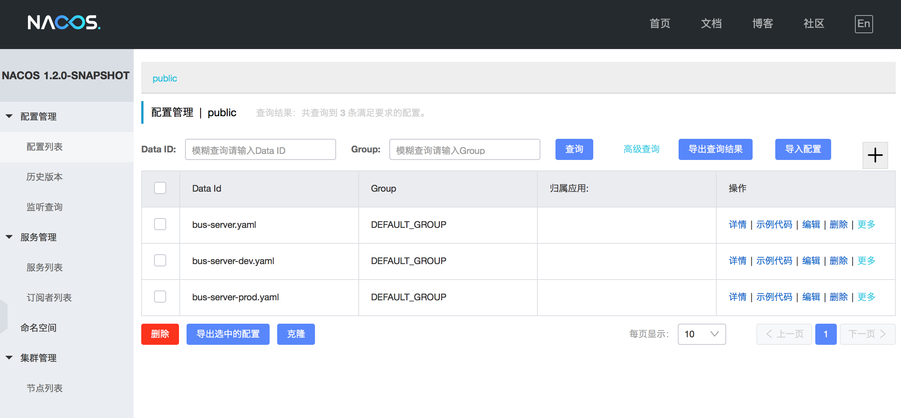

#注册中心

[Nacos](http://nacos.io) 是阿里巴巴团队开发，用户服务注册发现，服务配置，以及熔断，降级，限流等操作的中间件。

##启动方式：

1.Docker 启动

`docker-compose -f docker-compose.yml -f docker-compose.nacos.yml up -d nacos`

2.安装nacos服务端，使用命令启动

```
cd /nacos-server/bin
sh startup.sh -m standalone
```

##服务注册发现及服务配置

maven 配置
```
		<!-- 注册中心 -->
		<dependency>
			<groupId>com.alibaba.cloud</groupId>
			<artifactId>spring-cloud-starter-alibaba-nacos-discovery</artifactId>
		</dependency>
		<!-- 配置中心 -->
		<dependency>
			<groupId>com.alibaba.cloud</groupId>
			<artifactId>spring-cloud-starter-alibaba-nacos-config</artifactId>
		</dependency>
```

配置文件配置

```
server:
  port: 8071

spring:
  application:
    name: bus-server
# 多环境配置 dev prod
  profiles:
    active: prod

  cloud:
    nacos:
      discovery:
        server-addr: ${REGISTER_HOST:localhost}:${REGISTER_PORT:8848}

      config:
        server-addr: ${REGISTER_HOST:localhost}:${REGISTER_PORT:8848}
        # dataId: bus-server-prod.yaml
        file-extension: yaml
```

打开 [nacos控制台](http://localhost:8848/nacos/index.html)

##多环境配置
在nacos控制台中->配置管理->配置列表中，添加不同环境的配置文件。在配置文件中，使用spring.profiles.active 属性控制。如图所示：


##路由
路由、熔断、限流、降级，使用哨兵
```
		<!-- 熔断降级 -->
		<dependency>
			<groupId>com.alibaba.cloud</groupId>
			<artifactId>spring-cloud-starter-alibaba-sentinel</artifactId>
		</dependency>
```